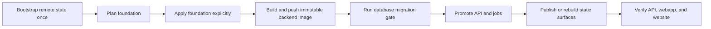

# Deployment

Production infrastructure is declared in [infra/README.md](../infra/README.md). Pick the hosting
from the audience recorded in [CHECKLIST.md](../CHECKLIST.md): Yandex Cloud for users/data in
Russia, DigitalOcean otherwise, or an own server only when the owner explicitly wants full control.
Local development never needs cloud credentials.

Provider runbooks:

- [DigitalOcean](DIGITALOCEAN.md)
- [Yandex Cloud](YANDEX_CLOUD.md)

## Supported production shape

| Concern               | DigitalOcean                        | Yandex Cloud                                   |
| --------------------- | ----------------------------------- | ---------------------------------------------- |
| API                   | App Platform service                | Serverless Container behind API Gateway        |
| Scheduled work        | App Platform scheduler worker       | Three HTTP job containers with timer triggers  |
| Database              | Managed PostgreSQL 18               | Managed Service for PostgreSQL 18              |
| Static webapp/website | App Platform Static Sites           | Two public Object Storage website buckets      |
| User media            | Private Spaces bucket               | Separate private Object Storage bucket         |
| Image registry        | DigitalOcean Container Registry     | Yandex Container Registry                      |
| Terraform state       | Private, versioned Space            | Private, versioned Object Storage bucket       |
| CDN                   | App Platform's static-site delivery | Off by default; Cloud CDN is opt-in            |

The launch profile intentionally uses one database node, and on DigitalOcean one API instance
(`instance_count = 1`). This is the economical starting point, not a high-availability claim.
Increase the provider-specific size and replica settings before the availability requirement
demands it.

Yandex is different and the difference matters: Serverless Containers scale out by running more
instances of the revision, and `concurrency` only sets how many requests one instance takes before
the next one starts. There is no setting that pins the API to a single process. Anything the
backend keeps in process memory is therefore per-instance there, and the auth rate limiter in
`backend/src/http/security.ts` is exactly that - its own comment states the condition. On Yandex,
treat `AUTH_RATE_LIMIT_MAX` and `ADMIN_USERS_READ_RATE_LIMIT_MAX` as per-instance budgets, not
global ones, until that counter is moved into shared state. PostgreSQL is the shared state this
repository already runs; see the rule in `docs/ARCHITECTURE.md` before reaching for anything else.

No Ansible is used on these two paths: there is no host to configure. Terraform owns managed and
serverless resources; the release script owns image build, migration ordering, static publication,
and verification. Ansible becomes useful only on the own-server path.

## Release sequence



Foundation and release states are separate. `infra:apply` is the only routine path that changes
stateful foundation resources; `release` requires its saved plan to contain no changes. The
release-owned roots are then idempotent and safe to resume. A migration failure stops before
runtime or static promotion.

Every non-dry foundation apply, release, and non-bootstrap import first holds a provider-wide
distributed lease in the separate `operations` Terraform state. The holder remains alive for the
whole multi-root sequence and exits if the wrapper dies; a second wrapper therefore fails at the
state lock instead of interleaving foundation, migration, runtime, or static mutations. The wrapper
rechecks ownership before and after every mutating phase and aborts the remaining sequence if the
holder is lost. Plans, outputs, dry runs, and bootstrap keep their existing root-scoped locking
behavior.

## Prerequisites

Both providers require:

- Terraform `>= 1.15, < 2`, Bun, Docker, Git, and a real production branch pushed to its upstream;
- three real HTTPS domains: API, webapp, and website;
- a 64-character hexadecimal JWT secret (`openssl rand -hex 32`);
- provider credentials with enough rights for the resources in the selected Terraform stack.

Yandex also needs `yc`, AWS CLI, and three Certificate Manager certificate IDs. DigitalOcean needs
`doctl`, an authorized App Platform GitHub connection for the configured repository, and Spaces
management credentials. Exact setup is in the provider runbook.

## Configure and bootstrap

Copy only the selected provider's examples. These destination files are ignored because they hold
project identifiers and may hold secrets:

```bash
cp infra/<provider>/bootstrap/terraform.tfvars.example infra/<provider>/bootstrap/terraform.tfvars
cp infra/<provider>/production/terraform.tfvars.example infra/<provider>/production/terraform.tfvars
```

Fill both files, export secret `TF_VAR_*` values described by the provider runbook, then create the
remote state bucket and scoped backend key:

```bash
bun run infra:bootstrap -- <digitalocean|yandex> --new --dry-run
bun run infra:bootstrap -- <digitalocean|yandex> --new
bun run infra:apply -- <digitalocean|yandex> --dry-run
bun run infra:apply -- <digitalocean|yandex>
```

The first apply starts with local bootstrap state, creates a private versioned state bucket and a
bucket-scoped key, then migrates that state to the S3-compatible backend. On Yandex, the script uses
temporary folder-level `storage.admin` only to create and version the bucket, removes it after
installing a policy scoped to the dedicated state service account, and only then migrates state.
That policy permits bucket-configuration refresh plus current state/lock objects, explicitly denies
bucket deletion, and never permits deleting object versions. It writes these ignored, mode-`0600`
files:

- `infra/<provider>/.env.terraform-state` — scoped backend credentials;
- `infra/<provider>/*/backend.backend.hcl` — endpoint, bucket, and state key, with no credentials.

Bootstrap is restart-safe. If a process stops after creating the credential file but before state
migration finishes, rerun the same command: a remaining local `terraform.tfstate` is authoritative,
so the script resumes `-migrate-state`, verifies the required remote outputs, and only then removes
the local state. Omit `--new` when resuming. It never treats the credential file alone as proof that
remote state is ready.

Back up the state environment file in the project's secret manager. Losing it does not expose the
cloud. If both it and local bootstrap state are absent, the wrapper refuses to create a second
backend. For DigitalOcean, reattach with a temporary account key that can access the exact existing
state Space. For Yandex, create the temporary key on the existing dedicated
`<project_slug>-tf-state` service account; a key from any other identity is rejected by the bucket
policy even if that identity has a broad folder role. Record both the returned access-key resource
ID (for revocation) and the one-time key ID/secret, then run:

```bash
export TF_STATE_RECOVERY_ACCESS_KEY_ID='<temporary key id>'
export TF_STATE_RECOVERY_SECRET_ACCESS_KEY='<temporary key secret>'
bun run infra:bootstrap -- <provider> \
  --recover-state-bucket=<existing-state-bucket> \
  --recover-state-region=<existing-bucket-region>
unset TF_STATE_RECOVERY_ACCESS_KEY_ID TF_STATE_RECOVERY_SECRET_ACCESS_KEY
```

The command reads and verifies the existing bootstrap state, reconciles its managed backend key,
verifies that key against the same bucket, reinitializes every root with it, and only then writes
the ignored credential marker. Revoke the temporary recovery key immediately after the success message
(`yc iam access-key delete <recovery-access-key-resource-id>` on Yandex). If the process is
interrupted, rerun the same command with the same temporary key: recovery writes backend
configuration first but keeps temporary credentials only in process memory, so no ready marker can
block the retry. Recovery intentionally has no dry-run mode and requires the provider credentials
normally used to apply the bootstrap root.

The Yandex foundation's first apply temporarily grants its storage-management identity
folder-level `storage.admin` while creating the three application buckets and enabling provider-
managed versioning/configuration. The same command installs `storage.admin` only on those three
buckets and immediately removes the folder grant. Publisher and media identities keep narrower
data-plane permissions. Every rerun automatically authorizes deletion of only that one known
temporary folder binding, so an interruption between create and tighten cannot strand broad
access. Steady-state plans assert that the broad binding is absent; the resulting IaC key cannot
read or damage the separate state bucket.

## Plan and release

Inspect foundation and every already-created release root at any time:

```bash
bun run infra:plan -- <digitalocean|yandex>
```

For the first release, provide the initial administrator only in the process environment:

```bash
export ADMIN_SEED_EMAIL='owner@example.com'
export ADMIN_SEED_PASSWORD='<random one-time password>'
bun run release -- <digitalocean|yandex> --dry-run
bun run release -- <digitalocean|yandex>
unset ADMIN_SEED_EMAIL ADMIN_SEED_PASSWORD
```

The script writes the seed to an ignored mode-`0600` migration-root input only for the migration,
then removes it. Yandex creates and deletes a migration-only Lockbox secret; DigitalOcean removes
the PRE_DEPLOY job variables in a second idempotent API deployment. On later releases omit both
values; `db:deploy` verifies that a login-capable administrator still exists. If a Yandex release
was interrupted after migration but before cleanup, the next release removes exactly the three
known seed resources before invoking migration, without requiring the old seed value again.

Log in once and change that administrator password immediately. Removing it from the active runtime
does not guarantee that provider deployment history, Lockbox version history, or versioned
Terraform state has forgotten the bootstrap value.

Before a non-dry release, the script reads the effective release branch (and DigitalOcean GitHub
repository) from the applied foundation state, fetches the checkout's upstream, and refuses:

- a detached, dirty, unpushed, behind, or wrong Git branch or upstream ref;
- on DigitalOcean, an upstream GitHub repository different from `github_repo`;
- a DigitalOcean token for a team other than the immutable `DO_EXPECTED_TEAM_UUID`;
- a Yandex CLI cloud/folder different from `terraform.tfvars`;
- deletion or replacement of PostgreSQL, the media bucket, registry, Lockbox secrets, or state;
- any other deletion unless its exact Terraform address is acknowledged with
  `--allow-destroy=<address>`.

The captured 40-character commit is also the build input: Docker and Yandex static builds consume
a tracked `git archive`, not the live working directory. DigitalOcean static apps build a
never-overwritten `infra-release/<sha>` branch, and the release checks App Platform's active
`source_commit_hash` for both apps before success. A later push advancing the mutable upstream does
not invalidate the already captured commit or stop a migration-gated promotion halfway through.

`--allow-destroy` is intentionally exact and never overrides stateful-resource protection. Import
or move an existing resource instead of authorizing its replacement.

## Secrets and state

Never commit `.tfvars`, backend credentials, generated auto-variable files, provider tokens, static
keys, or a Terraform plan. Terraform state necessarily contains sensitive resource values. The
state bucket and its key are therefore production credentials, not build artifacts.

Prefer `TF_VAR_*` environment variables or add real values to the local ignored
`terraform.tfvars`. Required secret assignments are deliberately absent from the copyable examples:
an assignment in `terraform.tfvars`, even an empty map or placeholder, has higher precedence than
`TF_VAR_*` and would silently replace the exported value. The runtime receives database, JWT,
media, and email credentials through provider secret fields or Yandex Lockbox; none are baked into
the image.

Yandex uses a login-capable, migration-only database owner plus two DML-only application users
(`blue` and `green`). Each runtime slot has its own persistent exact Lockbox version. The live
runtime reports its credential slot from the independent runtime state; before a foundation plan,
the wrapper compares that slot's version and password fingerprint with the previous foundation
state and refuses to replace it. Rotate and select only the inactive slot, apply foundation, then
release; if promotion fails, the old runtime still has both its login and secret version. The exact
operator sequence is in [YANDEX_CLOUD.md](YANDEX_CLOUD.md).

## Existing manually created infrastructure

Do not run the first foundation apply over resources that were created by the old CLI runbooks.
Resolve each real resource ID and import it into the matching root and address first:

```bash
bun run infra:import -- <provider> bootstrap <terraform-address> <provider-resource-id>
bun run infra:import -- <provider> foundation <terraform-address> <provider-resource-id>
bun run infra:plan -- <provider>
```

`bootstrap` imports work with local state before backend credentials exist and migrate normally on
the next bootstrap. Release-owned imports need the current immutable inputs so their configured
instances exist:

```bash
bun run infra:import -- digitalocean runtime digitalocean_app.api <app-id> \
  --runtime-image-digest=sha256:<64-hex>
bun run infra:import -- digitalocean static digitalocean_app.webapp <app-id> \
  --release-revision=<40-char-sha> --source-branch=infra-release/<40-char-sha>
bun run infra:import -- yandex migration yandex_serverless_container.migration <container-id> \
  --runtime-image-digest=sha256:<64-hex>
bun run infra:import -- yandex runtime yandex_serverless_container.api <container-id> \
  --runtime-image-digest=sha256:<64-hex>
```

The wrapper writes temporary release inputs, imports, and immediately checks a guarded saved plan.
Use the provider's current import ID syntax. Import every related instance (including timers or
static apps) before treating the plan as clean. A naming match alone does not prove ownership.

Static access-key resources are the exception: pinned providers do not support importing
`digitalocean_spaces_key` or `yandex_iam_service_account_static_access_key`, and their secret is
returned only at creation. The wrapper rejects those addresses instead of starting an impossible
import. Import the surrounding bucket, service account, Lockbox secret, and policy; let Terraform
create a new key; apply/release so every backend, runtime, and publisher consumer uses it; verify
state, media, and static publishing; only then revoke the legacy key. Never revoke the old state key
before the new backend credential has completed a second init/plan.

The wrapper also refuses replacement or deletion of either provider's active media key, Yandex
Postbox key, or the active Yandex database/JWT secret version even with `--allow-destroy`. Those
credentials cross the foundation/runtime state boundary, so replacing a single declared credential
would revoke it before the separately deployed API and jobs switch. A real rotation must first add
a second key/secret slot, apply only that addition, release and verify the new slot, and remove the
old credential in a later reviewed foundation change. Do not temporarily weaken the protected
resource list to turn that transition into one apply.

Existing PostgreSQL objects also keep their original owner when a database resource is imported.
Before the first Terraform-managed migration, inventory the `public` schema using a privileged
legacy connection (the URL stays in the environment and is never printed):

```bash
export DATABASE_URL='<legacy owner or privileged connection URL>'
export DATABASE_LEGACY_OWNER='<owner reported by the inventory>'
export DATABASE_MIGRATION_USER='<new migration owner from Terraform>'
bun run --cwd backend db:adopt-owner
```

The read-only command lists app-owned tables, sequences, views, routines, enums/domains, and the
schema whose owner differs; extension-managed members are deliberately excluded. It refuses mixed
legacy owners. Review the list, then perform the exact public-schema transfer once:

```bash
export CONFIRM_DATABASE_OWNER_ADOPTION="${DATABASE_LEGACY_OWNER}->${DATABASE_MIGRATION_USER}"
bun run --cwd backend db:adopt-owner -- --apply
unset DATABASE_URL DATABASE_LEGACY_OWNER DATABASE_MIGRATION_USER CONFIRM_DATABASE_OWNER_ADOPTION
```

`db:deploy` runs the same ownership preflight before Prisma and fails closed if adoption was
skipped. After every migration on both providers it removes public-schema creation, temporary-table,
object, routine, and matching default privileges inherited through PostgreSQL `PUBLIC`. It also
rejects DigitalOcean runtime users with elevated attributes, inherited roles, or owned objects;
there it revokes direct database/schema/table/sequence/default privileges and reapplies only
CONNECT, schema USAGE, table DML, and sequence use. The preflight and the whole ACL reconciliation
run in one transaction, so a failed grant cannot leave the active runtime with its previous
privileges already revoked.

## Rollback and recovery

Application rollback is a new commit (usually a revert) followed by the same release command. Do
not point a running service at a mutable tag. Database migrations are forward-only: write backward-
compatible expand/contract migrations so the previous application version can run during rollback.

If external DNS is not Terraform-managed, the first apply may create the target and then fail only
at URL verification. Run `bun run infra:output -- yandex`, read `required_dns_records`, update DNS,
wait for propagation, and rerun the release. The wrapper exposes only an allowlist of operational
outputs, never publisher credentials. Do not recreate resources.

If a Terraform apply fails, read the provider error, fix the owning configuration, and rerun plan.
Never edit state by hand, delete the state lock, or use `-target` as a routine deployment mechanism.
If an operating-system or machine failure leaves the `operations` lock stale, first confirm that no
`scripts/infra.mjs`, Terraform, or lease-holder process for that provider remains. Then initialize
`infra/<provider>/operations` with its generated backend configuration and state-key environment,
and run `terraform force-unlock <LOCK_ID>` using only the lock ID printed by Terraform for that
operations state. Never force-unlock an active holder or a different root.

## Own server

The own-server option remains deliberately separate from the two Terraform stacks. Build
`backend/Dockerfile`, run PostgreSQL 18+, apply `bun run --cwd backend db:deploy` before promotion,
serve `webapp/dist` and `website/dist` behind Caddy/nginx, run
`bun run --cwd backend start:scheduler` as a supervised service, and provide an S3-compatible
private media bucket. Use Ansible only when it reduces repeatable host configuration (packages,
users, firewall, systemd, proxy); keep database data, credentials, and releases out of playbook
templates. The operator owns TLS, backups, restore tests, patching, monitoring, and rollback.

## Local validation

Cloud mutation is never part of the local test suite. A release is the explicit broad-regression
trigger; validate the application and Terraform contracts before `infra:plan`:

```bash
bun run check
bun run test:terraform
```

`test:terraform` initializes every root with `-backend=false` in an isolated temporary data
directory before validate/test, so a clean checkout needs no backend credentials and cannot contact
production state. Provider downloads still require network access on the first run.

Run `infra:plan` with real credentials before any release. A mock-provider test proves the intended
shape; only a real plan can prove account limits, regions, domain ownership, and current cloud state.
